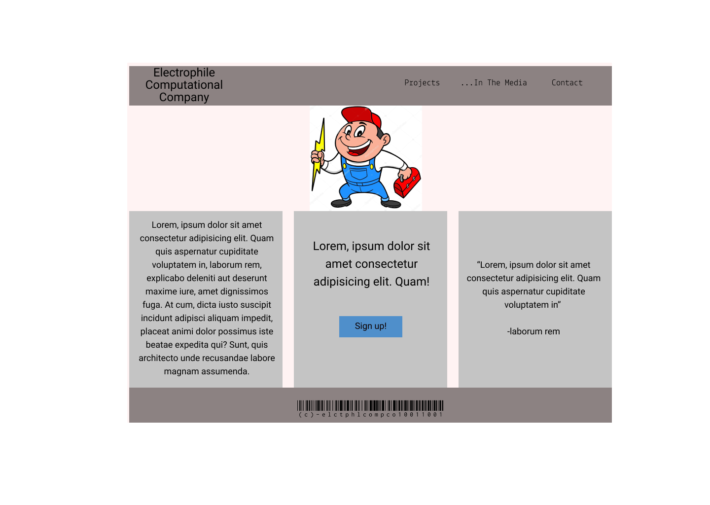
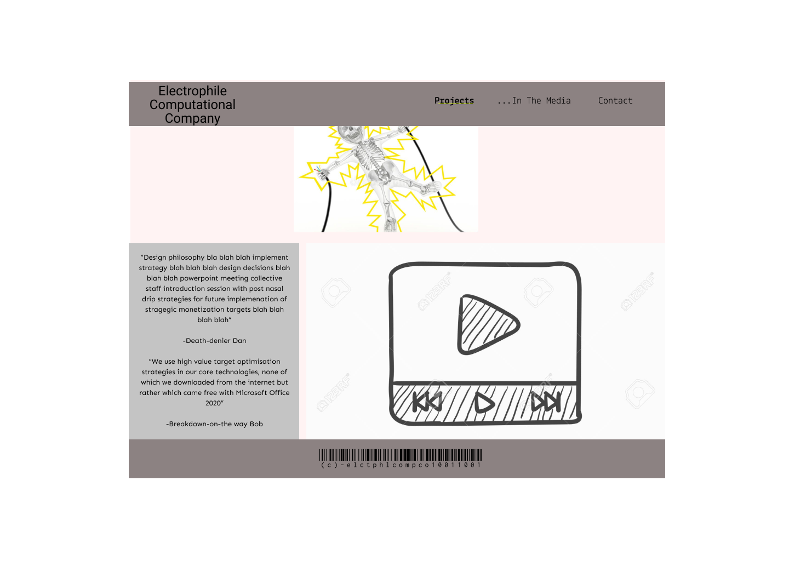
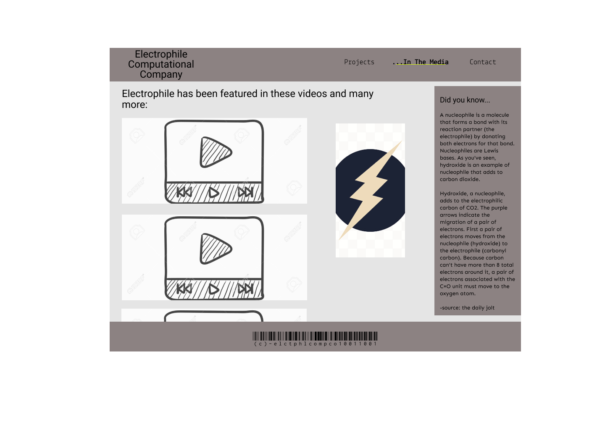
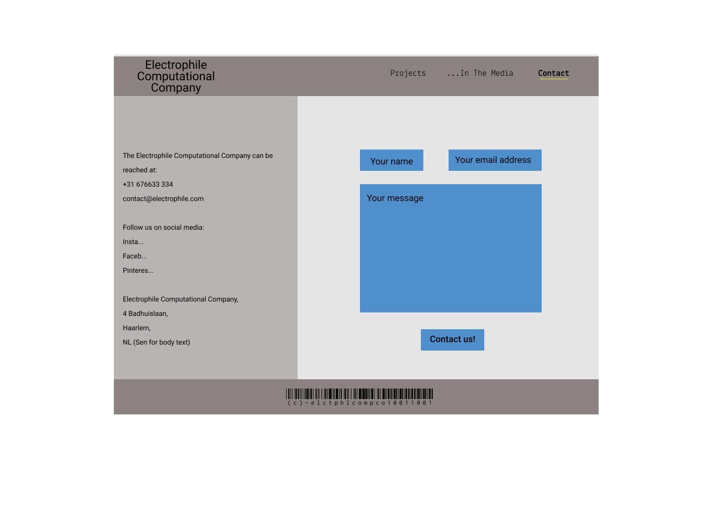

# The Electrophile Computational Company

## **Purpose**

This is a website to inform the public about a web-design/web-app dev company.

The skillset of the company includes copywriting as well as graphic design.

The impression given to the customer should be that we have a particular set of skills as well as a design-based orientation.

The playful, graphical character of the company should be evident on the site. The viewer should be able to have a sense immediately if we are of a similar mindset.

## **Features**

### Home page

 

- Home page (and consistent elements)

  - High contrast text (from left on desktop view, top on mobile view) informs you about our services, has a "call to action" section with a button, and a high value testimonial.
  - Sets the tone with grey backgrounds, header and footer and even body in lighter shades of grey. Strong contrast with colourful, playful imagery and button colour.
  - A responsive navigation area that clearly shows where the user is, using active classes. Also allows for a little bit of font variety, without distracting from the main Roboto family.
  - The footer, with its barcode styling, allows for some further visual indication of our design sensibilites.

 

 

### Projects (About Us) page

 

- Projects page (updated to About Us page)

  - Page with an image in one row, then two sections in another, in desktop mode.
  - The left section, about 30% of the screen, contains text that describes notable completed projects. Written from the perspective staff developers, designers and copywriters, it should project our particular skillset.
  - The right section will have an embedded video that documents a project that shows our company values and intentions. This would be a project that involves our work being part of a greater social effort. Ideally, this would add some greater scope to our company profile.

 

 

### **Media page**

 

- Media page

  - A page it is hoped that a visitor would spend some time on. The goal is not to overwhelm but to entertain while informing.
  - Layout wise, on desktop - half the screen will be video media. The remaining area on the right is split between an image element and an aside bar.
  - The videos should be short clips from design blogs and branding tutorials we have contributed to. Interspersed with that, some irreverent homemade entertainment.
  - The aside bar is a list of quotes from linked articles. (update: The aside bar will be an embedded article about our company linked from a prominent tech journal)

 

 

### **Contact page**

 

- Contact page

  - Layout with one third containing phone numbers, addresses and social links. Two thirds of the screen on the right is a contact form.
  - Spacious, grounded and inviting using line-height, contrast, white space and visual heirarchy.

## First Build

After building the site and getting it responsive-ish - it became clear that the Projects page needed to be an About Us page instead. It didn't seem effective to launch into specifics at that point.

### Things I could do better next time

Despite my intention being to build a mobile first site, I built the desktop view first. I regretted that as I felt my code was less compact than it could have been. Also the heirarchical structures of Flexbox is so much more intuitive when mobile-first. At least, it seems to me at this early point in my learning. I am considering whether to rebuild the site in that way, on a different branch and then compare later. (Update, lesson learned - its a total mess trying to reverse it. Not worth the time.)

### External video sizing issue

The most stubborn detail I have at this stage is getting the video player to behave naturally. It wants specific widths and heights, and doesn't want to flow along with the rest of the content.

[Hasan Armstrong solution for responsive iFrame player](https://www.youtube.com/watch?v=QG7JQkeaJy4)

The solution is to create a wrapper class with a position of relative, then position the iframe element as absolute. Top0 Left0 Width100% but most importantly, a padding-top of 56.25% which precisely constrains the default 16:9 Youtube video proportions. Use Vivo, more attractive.
